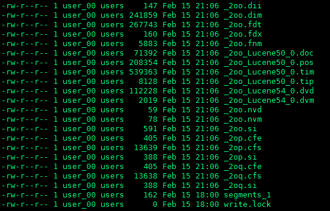
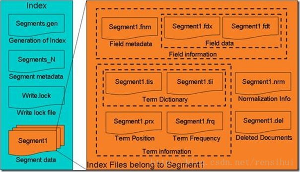

# Lucene6 索引文件格式
    要想要理解Lucene6关键还是要对索引的文件格式有所理解的，这是因为，了解到索引文件的格式，有助于深入理解Lucene6的两大功能——索引（全文搜索中倒排写成这个文件格式），搜索（在按文件格式将索引读取）。
    可以查看Lucene6中Reader和Writer这两个类包，来更加深入地了解Lucene的文件格式，以及那些文件格式的写入和读取过程。
## 索引文件

### （一）索引文件层次 
    (1)索引(Index)： 
        下图中同一文件夹中的所有的文件构成一个Lucene索引。 
    (2)段(Segment)： 
        一个索引可以有很多个段，段是独立的，添加新文档时可以合并。segments_e是段的元数据文件，保存了段的属性信息。 
    (3)文档(Document)： 
        文档是索引的基本单位，不同的文档是保存在不同的段中的，一个段可以包含多篇文档，并且，它可随着段的合并合并到同一段中。 
    (4)域(Field)： 
        域里保存的都是一篇文档包含的各种不同类型的信息，分开索引，比如标题，作者，正文等，比较重要。 
    (5)词(Term)： 
        词是索引的最小单位，是经过词法分析和语言处理后的字符串。 
    (6)正向信息（保存了从索引到词的包含关系）： 
        索引(Index) –> 段(segment) –> 文档(Document) –> 域(Field) –> 词(Term) 
        其中，在正向信息中，有segments_N，.fnm，.fdx，.fdt，.tvx，.tvd，.tvf等文件格式。 
    (7)反向信息（保存了词典到倒排表的映射）： 
        词(Term) –> 文档(Document) 
        其中，在反向信息中，有.tis，.tii，.frq，.prx等文件格式。 
   

### （二）从总体结构图看文件格式
   
#### (1)从正向信息来看 
     Index –> Segments(segments_N) –> Field(fnm, fdx, fdt) –> Term (tvx, tvd, tvf) 
     其中，各个文件格式代表的意义 
     segments_N: 它里边保存的是段(segment)的元数据信息(metadata),元数据信息包含索引文件格式的版本号（Format），索引的版本号（Version），下一个新段的段名（NameCount），段的个数（SegCount），SegCount的元数据信息（SegName和SegSize）等； 
     .fnm： 里边保存的是域(Field)的元数据信息。事实上，一个段(Segment)包含多个域，每个域都有一些元数据信息。它的元数据信息包括fnm文件的版本号（FNMVersion），域的数目（FieldsCount），数组的域(Fields，含FieldName、FieldBits等)。 
     .fdt: 域数据文件(fdt)，保存在存储域(stored field)中的信息。 
     .fdx: 域索引文件(fdx)，为了辨别每一篇文档的起始地址和终止地址，更快的找到第n篇文档的存储域的信息，需要记录fdt文件中的起始地址的偏移量等。 
     .tvx: 词向量索引文件（tvx），表示段包含N篇文档的N项，每一项包含tvd文档的偏移量和tvf文档中的第一个域的偏移量。 
     .tvd: 词向量文档文件(tvd)，N项，每一项包含域的个数s，数组大小；(NumFields - 1)数组及其偏移量等。 
     .tvf: 词向量域文件(tvf)，tvf文件包含了此段中的所有的域，词的个数，位置，偏移，词频等信息。 
#### （2）从反向信息来看 
     Term Dictionary => (tii, tis); Frequencies => (.frq); Positions => (.prx) 
     .tii: 词典文件(tii)，包含TermCount总词数，跳跃表结构，跳跃步数，跳跃表最大层数，TermCount个项的数组等； 
     .tis: 词典索引文件(tis)，内存中运行，含：词典索引文件中的词数（ IndexTermCount = TermCount / IndexInterval：），跳跃表结构，跳跃步数，跳跃表最大层数，IndexTermCount个项的数组等； 
     .frq: 文档号及词频(frq)信息 
     .prx: 词位置信息(prx)， 词位置信息也是倒排表，是以跳跃表形式存在。 
####     （3）其他 
     .cfs，.cfe: 复合索引的文件，是指除了段信息文件，锁文件，以及删除的文件外，其他的一系列索引文件压缩后而成的，所有的索引文件会被存储成一个单例的Directory，以便适应查询频繁而不经常更新的需求； 
     .si： 存储了段的元数据文件，即段的属性信息，包括：段中索引的文档数量，版本信息，段合并信息，指向该段的文件列表（例如fdt，.fdx文件）等； 
     .doc： 包含term列表，频次，termcount个项等； 
     .pos： 包含term的位置信息，倒排表以跳跃表形式存在的； 
     .tim： 词典，存储词信息； 
     .tip: 词索引，指向词典的索引； 
     write.lock： 锁文件，用来阻止多个indexWriter向同一个文件写数据； 
     .del： 删除文档； 
     .pay： 额外存储每个位置的元数据信息，如用户负载等 
     .nvd , .nvm： Norms， 文档\字段的length\boost系数的编码； 
     .dvd , .dvm： 文档的值，额外的得分系数\每个文档的值信息编码;

https://www.cnblogs.com/forfuture1978/category/300665.html
